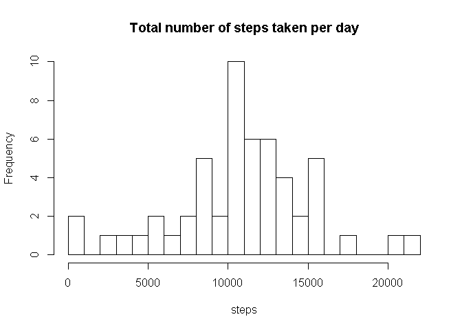
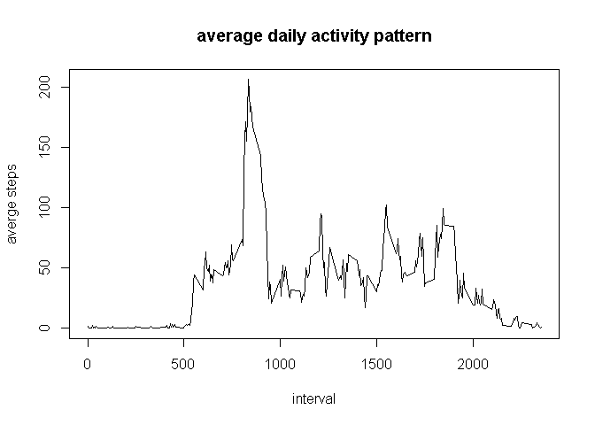
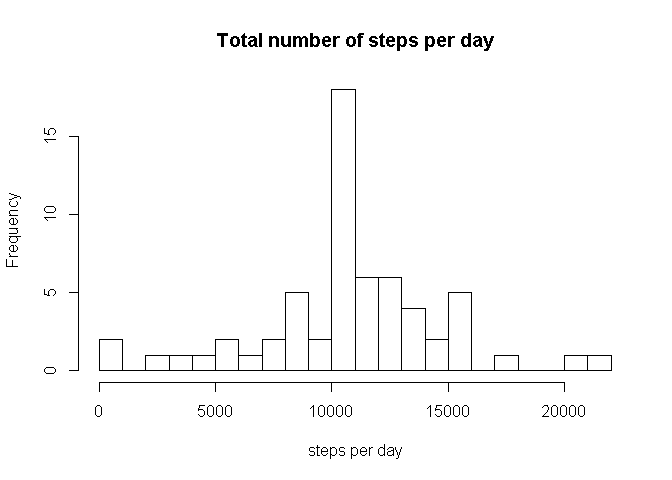
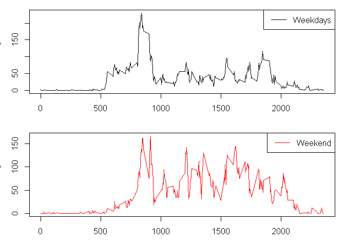

# Assignment 1
Feles  

## Loading and preprocessing the data

* set the work directory

```r
setwd("E:/moocs/c5")
```

### 1. Load the data

```r
filename <- "activity.csv"
raw_dat <- read.csv(filename) 
```

### 2. Summary the raw data

```r
str(raw_dat)
```

```
## 'data.frame':	17568 obs. of  3 variables:
##  $ steps   : int  NA NA NA NA NA NA NA NA NA NA ...
##  $ date    : Factor w/ 61 levels "2012-10-01","2012-10-02",..: 1 1 1 1 1 1 1 1 1 1 ...
##  $ interval: int  0 5 10 15 20 25 30 35 40 45 ...
```

```r
head(raw_dat)
```

```
##   steps       date interval
## 1    NA 2012-10-01        0
## 2    NA 2012-10-01        5
## 3    NA 2012-10-01       10
## 4    NA 2012-10-01       15
## 5    NA 2012-10-01       20
## 6    NA 2012-10-01       25
```

*   steps: number of steps taking in a 5-min interval
*   date: the date is in YYYY-MM-DD format
*   interval : the measurement in 5-min interval

## Mean total number of steps taken per day.

### 1. Remove the NAs from the raw data

```r
no_na <- na.omit(raw_dat)
```

### 2. Calculate the total number of steps take per day

* load the package "dplyr".

```r
library(dplyr)
```

* group the no_na data by "date"", and sum the steps per day,

```r
gp <- group_by(no_na, date)
steps_perday <- summarize(gp, total = sum(steps))
steps_perday
```

```
## Source: local data frame [53 x 2]
## 
##          date total
## 1  2012-10-02   126
## 2  2012-10-03 11352
## 3  2012-10-04 12116
## 4  2012-10-05 13294
## 5  2012-10-06 15420
## 6  2012-10-07 11015
## 7  2012-10-09 12811
## 8  2012-10-10  9900
## 9  2012-10-11 10304
## 10 2012-10-12 17382
## ..        ...   ...
```

### 3. Make a histogram of the total number of steps taken per day


```r
hist(steps_perday$total, main = "Total number of steps taken per day", xlab = "steps",breaks = 20)
```

 

### 4. Mean and median

```r
options(scipen = 5, digits = 2)
total_mean <- mean(steps_perday$total)
total_median <- median(steps_perday$total)
```
The mean of the total number of steps taken per day is 10766.19, and the median is 10765.

##  The average daily activity pattern

* average steps in 5-min interval across all the days

```r
mean_five_min_step <- summarize(group_by(no_na, interval), average = mean(steps))
mean_five_min_step
```

```
## Source: local data frame [288 x 2]
## 
##    interval average
## 1         0   1.717
## 2         5   0.340
## 3        10   0.132
## 4        15   0.151
## 5        20   0.075
## 6        25   2.094
## 7        30   0.528
## 8        35   0.868
## 9        40   0.000
## 10       45   1.472
## ..      ...     ...
```


### 1. Make a time series plot


```r
plot(mean_five_min_step, main = "average daily activity pattern", xlab = "interval", ylab = "averge steps", type = "l")
```

 

*   x-axis is the 5 minute interval
*   y-axis is the average steps number across all days

### 2. The maximum average step

```r
maximum <- subset(mean_five_min_step, average == max(average))
maximum
```

```
## Source: local data frame [1 x 2]
## 
##   interval average
## 1      835     206
```
The maximum average steps is 206.17 in the interval 835.

## Imputing missing values

### 1. Total number of missing values
* In the raw dataset, there are not missing values in the columns of "date" and "interval".

```r
na_location <- which(is.na(raw_dat$steps) == TRUE)
na_num <- length(na_location)
na_num
```

```
## [1] 2304
```
So, there are 2304 NAs in the dataset.

### 2. Strategy for filling in all the missing value

* using the average 5_min steps in a interval to replace the NAs.
For example, the average 5_min steps for the interval 5 is 0.339, using the 0.339 to replace all NAs for the interval 5 of raw dataset.

### 3. Create a new dataset with the missing data filled in
* using loop function to replace all NAs

```r
rep_dat <- raw_dat
for(i in 1:length(mean_five_min_step$interval)) {
    index <- which(is.na(raw_dat) == TRUE & raw_dat$interval == mean_five_min_step$interval[i])
    rep_dat$steps[index] <- mean_five_min_step$average[i]
}
str(rep_dat)
```

```
## 'data.frame':	17568 obs. of  3 variables:
##  $ steps   : num  1.717 0.3396 0.1321 0.1509 0.0755 ...
##  $ date    : Factor w/ 61 levels "2012-10-01","2012-10-02",..: 1 1 1 1 1 1 1 1 1 1 ...
##  $ interval: int  0 5 10 15 20 25 30 35 40 45 ...
```

```r
head(rep_dat)
```

```
##   steps       date interval
## 1 1.717 2012-10-01        0
## 2 0.340 2012-10-01        5
## 3 0.132 2012-10-01       10
## 4 0.151 2012-10-01       15
## 5 0.075 2012-10-01       20
## 6 2.094 2012-10-01       25
```

### 4. Histogram of total steps taken each day after missing values were imputed

* Grouping the new dataset by date, and caculating the total steps in a day

```r
rep_total_steps <- summarize(group_by(rep_dat, date), total = sum(steps))
```
* make a histogram

```r
hist(rep_total_steps$total, main = "Total number of steps per day", xlab = "steps per day",breaks = 20)
```

 

### 5. Mean & median of steps taken per day


```r
rep_total_mean <- mean(rep_total_steps$total)
rep_total_median <- median(rep_total_steps$total)
```

* In the first part of this assignment, the mean value is 10766.19. After filling the NAs, the mean value is 10766.19. As you can see, there is no difference between the two value
* However, the median value in the first part is 10765, while the median value of the dateset filled in NAs is 10766.19. There is slightly difference between them.
* There is no significant impact of imputing missing data on the estimates of the total daily number of steps.


## Activity patterns of weekdays and weekends

### 1. Create a new factor with two levels -- "weekday" and "weekend"


```r
Sys.setlocale("LC_TIME", "US")
```

```
## [1] "English_United States.1252"
```

```r
w <- weekdays(as.Date(rep_dat$date))
week_dat <- mutate(rep_dat, days = ifelse(w %in% c("Saturday", "Sunday"), "weekend", "weekday"))
```

### 2. Split the dataset and caculate the 5-min average separately

```r
weekday_dat <- filter(week_dat, days == "weekday")
weekday_mean <- summarize(group_by(weekday_dat, interval), average = mean(steps))
weekend_dat <- filter(week_dat, days == "weekend")
weekend_mean <- summarize(group_by(weekend_dat, interval), average = mean(steps))
```

### 3. Make a panel plot

```r
par(mfrow = c(2, 1), mar = c(3, 3, 1, 1))
plot(weekday_mean, type = "l")
legend("topright", lty = 1, "Weekdays")
plot(weekend_mean, type = "l",col = "red")
legend("topright", col = "red", lty = 1, "Weekend")
```

 

